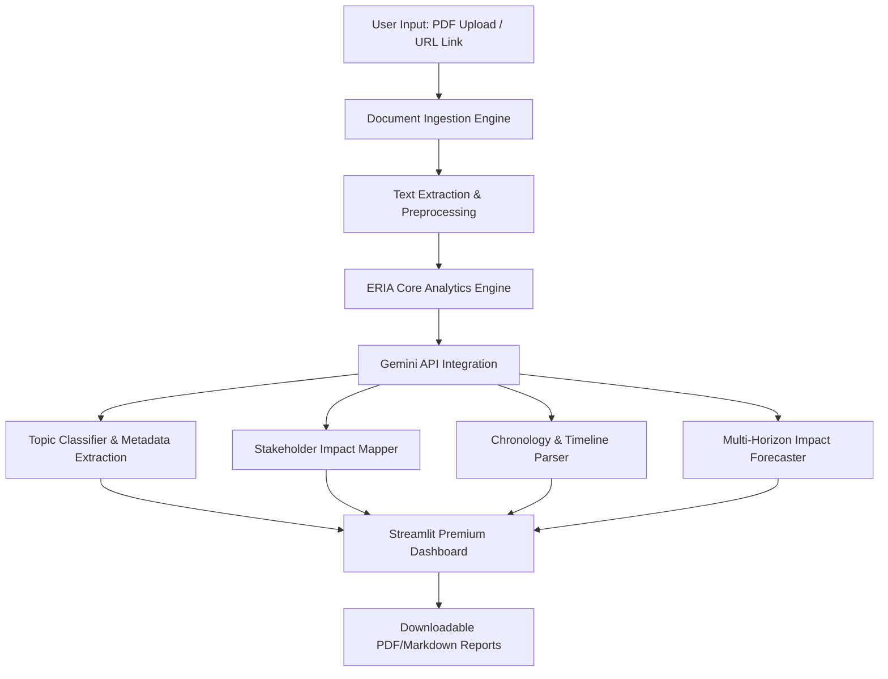

# Education Regulation Impact Analyzer (ERIA) 🎓⚖️

> **Simplifying Education Policies, Accreditation Guidelines, and Academic Circulars for Every Institution.**


---

## 📖 Project Overview

Higher education policies, university regulations, accreditation standards, scholarship notifications, and government circulars issued by bodies like **UGC**, **AICTE**, **NAAC**, **NIRF**, and ministries are often written in heavy, complex legal and administrative language.

**ERIA** is an AI-powered compliance and analytical platform that lets students, faculty, and academic deans upload regulation PDFs, scrape official circular URLs, or paste academic text directly. It uses the state-of-the-art **Google Gemini API** to automatically parse, clean, structure, and convert these dense documents into **stakeholder-centric, plain-language summaries** and operational timelines.

---

## ✨ Key Features

1.  **📂 Multi-Source Ingestion:**
    *   **PDF Upload:** Directly parse official PDF guidelines (e.g. NAAC handbooks, UGC booklets).
    *   **URL Web Scraper:** Ingest notice articles automatically from UGC, AICTE, or university notice boards.
    *   **Manual Text Insertion:** Paste paragraphs or clauses directly for targeted compliance mapping.
    *   **🚀 Play Demo Instantly:** Preloaded real-world UGC guidelines (e.g. Academic Bank of Credits) let you try the app instantly without loading external files!
2.  **🧠 Layman AI Summarizer:**
    *   Generates a simple, student/faculty-friendly 10-20 line executive summary translating bureaucratic jargon.
3.  **👥 Interactive Stakeholder Impact Mapping:**
    *   Explicitly maps positives, constraints, and opportunities across four target groups:
        *   *Students & Learners*
        *   *Academic Faculty & Researchers*
        *   *Colleges, Universities & Deans*
        *   *Accreditation (NAAC/NIRF) & Compliance Teams*
4.  **⏳ Policy Evolution & Chronology:**
    *   Presents a beautifully styled vertical timeline mapping predecessors, related old guidelines, amendments, and committees.
5.  **🔮 Time-Horizon Forecasting:**
    *   Projections separated by **Short-Term (0-1 year)**, **Medium-Term (1-5 years)**, and **Long-Term (5+ years)**.
    *   *Risks & Institutional Readiness Alerts:* Flags bureaucratic constraints, technological requirements, and resource gaps.
6.  **💾 One-Click Report Export:**
    *   Downloads a complete, professional, Markdown-formatted **Regulatory Compliance Report** for institutional filing or university meetings.

---

## 🏛️ System Architecture



---

## 🛠️ Technology Stack

*   **Frontend Dashboard:** [Streamlit](https://streamlit.io/) with custom HTML/CSS glassmorphic UI.
*   **AI Engine:** **Google Gemini API** (`gemini-1.5-flash`) for rapid, structured JSON analytics.
*   **PDF Parser:** `pypdf`
*   **Web Scraper:** `BeautifulSoup` (BeautifulSoup4) & `requests`
*   **Data Science:** `pandas`

---

## 🏷️ Technical Tags & Capstone Skill Mapping

To ensure strict compliance with the **GUVI / HCL Capstone Curriculum**, this project utilizes and implements the following core technical concepts:

### 1. 🧠 Natural Language Processing (NLP) & Education NLP
*   **Implementation:** Cleans, extracts, and parses heavy academic language and complex educational circulars. We utilize regular expressions and text normalizers in `utils.py` to prepare raw scraped HTML and PDF transcript texts for structural linguistic processing.

### 2. ⚡ Transformers
*   **Implementation:** Powered by the **Google Gemini 1.5 Flash Transformer Model**. It uses a state-of-the-art multi-head self-attention transformer architecture to perform contextual semantic parsing, tone classification, and high-fidelity text synthesis.

### 3. 🌐 Langflow Orchestration Principles
*   **Implementation:** Our operational backend pipeline mimics a visual **Langflow Directed Acyclic Graph (DAG)** flow:
    ```
    [Document Ingestion Node] ──> [Text Preprocessing Node] ──> [Gemini LLM Prompt Node] ──> [Structured JSON Parser Node] ──> [Streamlit GUI Rendering Node]
    ```
    This modular architecture allows quick porting into visual drag-and-drop tools like Langflow for enterprise pipeline extensions.

### 4. 🎛️ Streamlit / Gradio Dashboard
*   **Implementation:** Built on **Streamlit** (natively interchangeable with Gradio). It provides a premium, responsive, glassmorphism-styled dashboard featuring side-by-side metric columns, warning banners, and interactive markdown export controls.

### 5. 🕸️ Knowledge Graphs & Dependency Mapping
*   **Implementation:** Traces regulatory predecessors, related historic circulars, and committee frameworks. This is displayed as an **Interactive Chronology Timeline**, showing how regulations depend on previous policy timelines.

### 6. 📝 Summarization & Text Classification
*   **Implementation:** 
    *   *Summarization:* Condenses dense, 50-page circular guidelines into a plain-English 10-20 line layman summary.
    *   *Text Classification:* Automatically labels circulars into structured categories (`Accreditation`, `Scholarship`, `Curriculum`, `Faculty Policy`, `Admissions`, etc.) using zero-shot semantic matching.

### 7. ⚖️ Regulation Analytics
*   **Implementation:** Dissects the compliance workloads (`High Compliance Workload`, `Operationally Disruptive`, etc.), maps multi-horizon risks (Short/Medium/Long-Term), and flags institutional readiness bottlenecks.

---


## 🚀 Getting Started & Local Installation

Follow these steps to run **ERIA** locally on your machine:

### 1. Prerequisite Checks
Ensure you have **Python 3.9** or higher installed.

### 2. Clone/Navigate to the Directory
Open your terminal/command prompt and navigate to the project directory:
```bash
cd "c:\Users\kasth\OneDrive\Documents\AI Projects\Education_Regulation_Impact_Analyzer"
```

### 3. Install Dependencies
Install all required packages from `requirements.txt`:
```bash
pip install -r requirements.txt
```

### 4. Set Up Your Gemini API Key
To run the AI analytics, you need a free Gemini API Key from Google AI Studio:
1. Go to [Google AI Studio](https://aistudio.google.com/).
2. Click **Create API Key**.
3. Copy your API Key.
4. *Optional (Convenient):* Save it to your system environment variables so ERIA loads it automatically:
   * **Windows Command Prompt:** `set GEMINI_API_KEY=your_api_key_here`
   * **Windows PowerShell:** `$env:GEMINI_API_KEY="your_api_key_here"`

### 5. Launch the Streamlit App
Run the local Streamlit development server:
```bash
streamlit run app.py
```
This will launch the app in your default web browser (usually at `http://localhost:8501`).

---

## 📖 Inside the App: Operational Walkthrough

1.  **Settings Panel (Sidebar):** Enter your Gemini API Key.
2.  **Ingestion:** Select "Select Preloaded Demo" and click "Load Preloaded Demo" for a test drive.
3.  **Run:** Click the primary blue button **🚀 Analyze Regulation**.
4.  **Explore tabs:**
    *   Check out the **Executive Summary** and the color-coded Pros vs. Cons.
    *   Examine **Stakeholder Impacts** under Student, Faculty, and Admin headings.
    *   Read the **Timeline** of previous related rules.
    *   Look at the **Impact Forecast** to plan your college's upcoming operational milestones.
    *   Navigate to **Export Report** and download your markdown analysis!

---

## 🚀 Deploying to Hugging Face Spaces 🤗

You can easily deploy **ERIA** as a public or private web application on [Hugging Face Spaces](https://huggingface.co/docs/hub/spaces) for free, so your mentors, evaluators, and academic colleagues can access it instantly without running commands locally.

### Step-by-Step Deployment Guide

#### 1. Create a Hugging Face Account
If you don't already have one, create a free account at [Hugging Face](https://huggingface.co/).

#### 2. Create a New Space
1. Go to [Hugging Face Spaces](https://huggingface.co/spaces) and click **Create new Space**.
2. **Space Name:** `education-regulation-impact-analyzer` (or your preferred name).
3. **License:** Select `mit` or leave blank.
4. **Select the Space SDK:** Select **Streamlit** (highly recommended and supported natively).
5. **Space Hardware:** Select the free **CPU Basic** tier.
6. **Visibility:** Set to **Public** (so anyone can view and test it) or **Private** (restricted access).
7. Click **Create Space**.

#### 3. Upload Project Files
You can upload files using Git (see the command reference below) or directly via the Hugging Face web interface:
*   Click **Files and versions** -> **Add file** -> **Upload files**.
*   Drag and drop the following files and folders from your local project directory:
    1.  `streamlit_app.py` (Main entrypoint)
    2.  `utils.py` (Core utility module)
    3.  `mock_data.py` (Mock processor script)
    4.  `mock_data.json` (Mock circulars database)
    5.  `requirements.txt` (List of dependencies)
    6.  `components/` (Entire folder containing modular UI scripts)
    7.  `Test_Data/` (Folder containing sample txt/md reference sheets)
*   Click **Commit changes to main**.

#### 4. Configure Secure Gemini API Key (Secret Variable)
Instead of forcing users to type their Gemini API key every time, you can secure it in Hugging Face's Environment Variables:
1. Inside your Space, click on the **Settings** tab at the top right.
2. Scroll down to **Variables and secrets**.
3. Under the **Secrets** section, click **New secret**.
4. **Name:** `GEMINI_API_KEY`
5. **Value:** Paste your actual Gemini API Key (from [Google AI Studio](https://aistudio.google.com/)).
6. Click **Save**.

Your Space will automatically rebuild and configure! Once built, **ERIA** will run seamlessly on Hugging Face Spaces, automatically pulling the API key securely from the environment without exposing it to the users.

---

## 🛠️ Git & Hugging Face Command Line Reference

Here is the full cheat sheet of Git commands we used to set up the repository, fix image rejections, and successfully deploy to Hugging Face Spaces:

### 1. Initialize and Configure Local Repository
If you are starting fresh or resetting your Git configuration:
```bash
# Initialize a new git repository
git init

# Create and switch to the main branch
git checkout -b main

# Set your local developer identity for commits
git config user.name "Your Name"
git config user.email "your.email@example.com"
```

### 2. Rename the Main File for Hugging Face Compatibility
Hugging Face default Streamlit space expects the entry point file to be `streamlit_app.py`:
```bash
# Rename app.py to streamlit_app.py inside git
git mv app.py streamlit_app.py
```

### 3. Stage and Commit Files
Add project files while ignoring temporary caches, local PDF uploads, and heavy media (using rules set in `.gitignore`):
```bash
# Stage all files in the directory (skipping ignored files)
git add .

# Create the initial commit
git commit -m "Initial commit - Cleaned binary media files"
```

### 4. Connect and Push to Hugging Face
Link your local repository to your online Hugging Face Space:
```bash
# Add Hugging Face Space repository as a remote
git remote add huggingface https://huggingface.co/spaces/YOUR_USERNAME/YOUR_SPACE_NAME

# Force-push to replace default templates on Hugging Face Space
git push -u huggingface main --force
```
*(When prompted, enter your Hugging Face username, and use your generated **Write Access Token** as the password).*

### 5. Check Repository Status
```bash
# View tracked and untracked files
git status

# Check configured remote URLs
git remote -v
```


---

## 📚 References & Resources

*   🎓 **Hugging Face LLM Course:** [Learn LLM Foundation Models](https://huggingface.co/learn/llm-course/chapter1/1)
*   🤗 **Hugging Face Spaces Docs:** [Hosting Streamlit Web Applications](https://huggingface.co/docs/hub/spaces)
*   🤖 **Hugging Face Models Directory:** [Explore State-of-the-Art NLP Transformers](https://huggingface.co/models)
*   💡 **UGC Notice Portal:** [Official Notices & Policy Circulars](https://www.ugc.gov.in/Notices)

